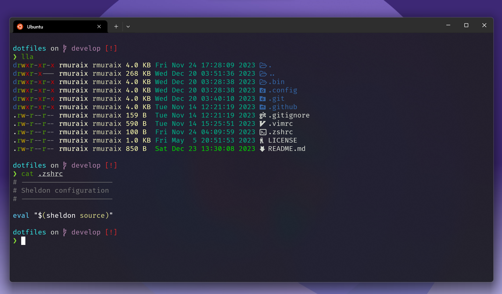

# dotfiles


[](https://github.com/rmuraix/dotfiles/actions/workflows/ci.yml)  
  
This is my personal collection of configuration files.  
Here are some details about my setup:  
- **OS**: Ubuntu
- **Shell**: zsh
- **Editor**: VSCode (and Neovim)

## Features

- Shell plugin management w/ [sheldon](https://sheldon.cli.rs/)
- Neovim plugin management w/ [lazy.nvim](https://github.com/folke/lazy.nvim)
- Runtime management w/ [mise](https://github.com/jdxcode/mise)
- Dress up w/ [Starship](https://starship.rs/)
- one-step installer
## Requirements
- [Nerd font](https://www.nerdfonts.com/font-downloads)
## Installation

```sh
make all
chsh -s $(which zsh)
```
