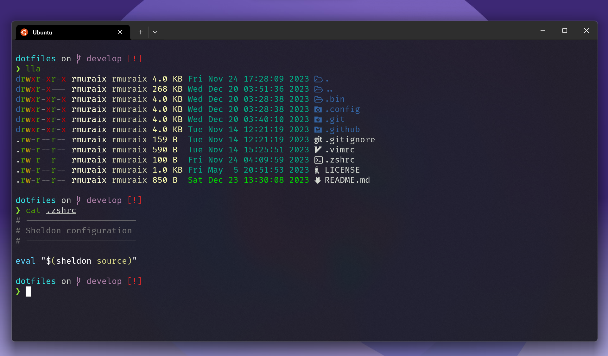

# dotfiles


[](https://github.com/rmuraix/dotfiles/actions/workflows/ci.yml)
[](https://github.com/rmuraix/dotfiles/actions/workflows/deploy-image.yml)  
  
This is my personal collection of configuration files.  
Here are some details about my setup:

- **OS**: Linux / macOS
- **Shell**: zsh
- **Editor**: VSCode (and Neovim)

## Features

- Shell plugin management w/ Home Manager
- Runtime management w/ [mise](https://mise.jdx.dev/)
- Neovim plugin management w/ [lazy.nvim](https://github.com/folke/lazy.nvim)
- Dress up w/ [Starship](https://starship.rs/)
- one-step installer

## Requirements

- [Nix](https://nixos.org/download/)
- `home-manager` command available in your user environment
- [Nerd font](https://www.nerdfonts.com/font-downloads)

## Installation

```sh
git clone https://github.com/rmuraix/dotfiles.git "$HOME"/dotfiles \
&& cd "$HOME"/dotfiles \
&& make all \
&& chsh -s $(which zsh)
```

Managed config sources live in `configs/`, Home Manager lives in `home-manager/`, and Homebrew bundle definitions live in `brew/`.
`~/.config` is not linked to this repository; Home Manager places only the managed files there.

`init.sh` prepares the host system, `install.sh` installs user-space tools and links dotfiles, and `make switch` applies Home Manager.
`make all` assumes Nix and the standalone `home-manager` command are already installed.

To apply the Home Manager configuration after changes, use:

```sh
home-manager --extra-experimental-features 'nix-command flakes' switch --flake .#rmuraix
```

or:

```sh
make switch
```

Additional flake targets are available for macOS:

- `.#rmuraix-aarch64-darwin`
- `.#rmuraix-x86_64-darwin`

`make switch` picks a target from the current host. You can override it with `make switch TARGET=...`.

### Docker

```sh
docker pull ghcr.io/rmuraix/dotfiles:main
```
