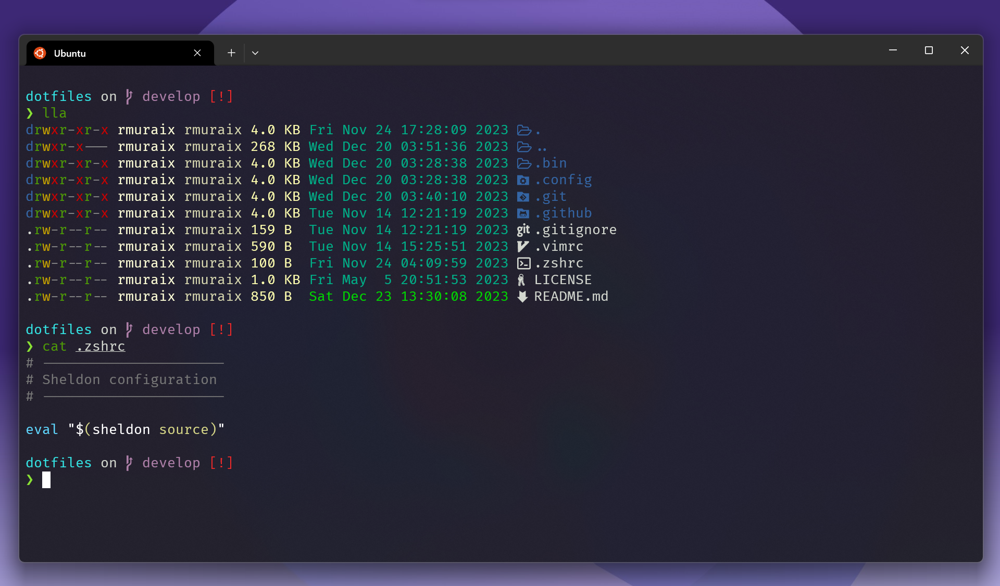

# dotfiles


[](https://github.com/rmuraix/dotfiles/actions/workflows/ci.yml)
[](https://github.com/rmuraix/dotfiles/actions/workflows/deploy-image.yml)  
  
This is my personal collection of configuration files.  
Here are some details about my setup:

- **OS**: Ubuntu
- **Shell**: zsh
- **Editor**: VSCode (and Neovim)

## Features

- Shell plugin management w/ [sheldon](https://sheldon.cli.rs/)
- CLI tools & runtime management w/ [mise](https://mise.jdx.dev/)
- GUI apps & fonts w/ Homebrew Cask (macOS only)
- Neovim plugin management w/ [lazy.nvim](https://github.com/folke/lazy.nvim)
- Dress up w/ [Starship](https://starship.rs/)
- one-step installer

## Requirements

- [Nerd font](https://www.nerdfonts.com/font-downloads)

## Installation

```sh
git clone https://github.com/rmuraix/dotfiles.git "$HOME"/dotfiles \
&& cd "$HOME"/dotfiles \
&& make all \
&& chsh -s $(which zsh)
```

### Remote server (no sudo)

CLI tools are installed into the user directory via [mise](https://mise.jdx.dev/), so Homebrew is not required:

```sh
git clone https://github.com/rmuraix/dotfiles.git "$HOME"/dotfiles \
&& cd "$HOME"/dotfiles \
&& bash install.sh
```

Keep machine-specific settings (PATH, cluster helpers, etc.) in `~/.zshrc.local`, which is sourced at the top of `.zshrc`. `install.sh` moves any pre-existing `.zshrc` to `~/.dotbackup/`, so you can preserve it with either of:

```sh
cp ~/.zshrc ~/.zshrc.local              # before install.sh
cp ~/.dotbackup/.zshrc ~/.zshrc.local   # after install.sh
```

### Docker

```sh
docker pull ghcr.io/rmuraix/dotfiles:main
```
